# Design Document

## Overview

This design document outlines the completion of OSSB (Open Source Slim Builder) as a production-ready Docker-in-Docker container builder for Kubernetes environments. The current implementation provides a solid architectural foundation (~35% complete) with working CLI, Dockerfile parsing, dependency graph generation, and caching framework. However, critical components like base image pulling, command execution, layer management, and registry operations need to be implemented.

The design focuses on completing the missing functionality while maintaining OSSB's core architectural principles: monolithic design, content-addressable caching, pluggable components, and rootless operation.

## Architecture

### Current Architecture (Working Components)

```mermaid
graph TB
    CLI[CLI Interface] --> Builder[Build Engine]
    Builder --> Frontend[Dockerfile Frontend]
    Builder --> Cache[Content-Addressable Cache]
    Builder --> Solver[Graph Solver]
    
    Frontend --> Parser[Dockerfile Parser]
    Solver --> Graph[Dependency Graph]
    
    subgraph "Working Components ✅"
        CLI
        Frontend
        Parser
        Cache
        Solver
        Graph
    end
```



### Target Architecture (Complete System)


## Components and Interfaces

### 1. Registry Client System

**Purpose**: Handle all container registry operations including authentication, image pulling, and pushing.

**Interface Design**:
```go
type RegistryClient interface {
    // Authentication
    Authenticate(registry string, credentials *Credentials) error
    
    // Image operations
    PullImage(ref ImageReference, platform Platform) (*ImageManifest, error)
    PushImage(ref ImageReference, manifest *ImageManifest) error
    PushManifestList(ref ImageReference, manifestList *ManifestList) error
    
    // Metadata operations
    GetImageManifest(ref ImageReference, platform Platform) (*ImageManifest, error)
    GetManifestList(ref ImageReference) (*ManifestList, error)
}

type ImageReference struct {
    Registry   string
    Repository string
    Tag        string
    Digest     string
}

type Credentials struct {
    Username string
    Password string
    Token    string
}
```

**Implementation Strategy**:
- Use existing Go container registry libraries (containers/image, google/go-containerregistry)
- Support Docker Hub, private registries, and cloud registries (ECR, GCR, ACR)
- Implement credential discovery from Docker config, Kubernetes secrets, and environment variables
- Add retry logic and proper error handling for network operations

### 2. Enhanced Execution System

**Purpose**: Complete the executor implementations to properly handle base image extraction, command execution, and filesystem layer creation.

**Current Executor Interface** (already defined):
```go
type Executor interface {
    Execute(operation *types.Operation, workDir string) (*types.OperationResult, error)
}
```

**Enhanced Implementation Strategy**:

#### Local Executor Completion
- **Base Image Handling**: Extract pulled images to filesystem using tar extraction
- **Command Execution**: Use os/exec to run commands in chroot environment
- **Layer Creation**: Capture filesystem changes using overlay filesystems or diff tools
- **Multi-stage Support**: Manage multiple filesystem contexts for different stages

#### Container Executor Enhancement
- **Rootless Podman Integration**: Use podman API for container operations
- **Cross-platform Emulation**: Leverage QEMU for multi-architecture builds
- **Volume Management**: Properly mount build context and manage temporary volumes
- **Network Isolation**: Ensure builds run in isolated network environments

#### Rootless Executor Completion
- **User Namespace Setup**: Properly configure user/group ID mapping
- **Filesystem Permissions**: Handle permission mapping between host and container
- **Security Context**: Ensure builds run without privileged access
- **Resource Limits**: Implement proper resource constraints for security

### 3. Layer Management System

**Purpose**: Implement proper OCI-compliant filesystem layer creation, management, and optimization.

**Interface Design**:
```go
type LayerManager interface {
    // Layer creation
    CreateLayer(changes []FileChange) (*Layer, error)
    ExtractLayer(layer *Layer, targetPath string) error
    
    // Layer optimization
    OptimizeLayers(layers []*Layer) ([]*Layer, error)
    DeduplicateLayers(layers []*Layer) ([]*Layer, error)
    
    // Layer metadata
    GetLayerDigest(layer *Layer) (string, error)
    GetLayerSize(layer *Layer) (int64, error)
}

type Layer struct {
    Digest      string
    Size        int64
    MediaType   string
    Blob        io.ReadCloser
    Annotations map[string]string
}

type FileChange struct {
    Path      string
    Type      ChangeType // Added, Modified, Deleted
    Mode      os.FileMode
    Content   io.Reader
    Timestamp time.Time
}
```

**Implementation Strategy**:
- Use overlay filesystems (overlayfs) for efficient layer management
- Implement proper tar stream generation for OCI layer format
- Add layer deduplication based on content hashing
- Support whiteout files for proper deletion handling in layers

### 4. OCI Manifest Generation

**Purpose**: Generate OCI-compliant image manifests, configurations, and manifest lists for multi-architecture images.

**Interface Design**:
```go
type ManifestGenerator interface {
    // Single architecture manifests
    GenerateImageManifest(config *ImageConfig, layers []*Layer) (*ImageManifest, error)
    GenerateImageConfig(instructions []DockerfileInstruction, platform Platform) (*ImageConfig, error)
    
    // Multi-architecture manifests
    GenerateManifestList(manifests []PlatformManifest) (*ManifestList, error)
    
    // Validation
    ValidateManifest(manifest *ImageManifest) error
    ValidateManifestList(manifestList *ManifestList) error
}

type ImageConfig struct {
    Architecture string
    OS           string
    Config       ContainerConfig
    RootFS       RootFS
    History      []HistoryEntry
}

type PlatformManifest struct {
    Platform Platform
    Manifest *ImageManifest
    Size     int64
    Digest   string
}
```

**Implementation Strategy**:
- Follow OCI Image Specification v1.0+ strictly
- Generate proper image configurations with environment, working directory, entrypoint
- Create manifest lists for multi-architecture support
- Implement proper digest calculation and validation

### 5. Kubernetes Integration Layer

**Purpose**: Ensure seamless operation within Kubernetes pods with proper secret handling, volume mounting, and job completion.

**Interface Design**:
```go
type KubernetesIntegration interface {
    // Secret management
    LoadRegistryCredentials() (*Credentials, error)
    LoadBuildSecrets() (map[string]string, error)
    
    // Volume handling
    MountBuildContext(contextPath string) error
    SetupWorkspace(workspaceSize string) error
    
    // Job lifecycle
    ReportProgress(stage string, progress float64) error
    SetJobStatus(status JobStatus, message string) error
}

type JobStatus string

const (
    JobStatusRunning   JobStatus = "Running"
    JobStatusSucceeded JobStatus = "Succeeded"
    JobStatusFailed    JobStatus = "Failed"
)
```

**Implementation Strategy**:
- Read Kubernetes secrets from mounted volumes (/var/run/secrets/)
- Support ConfigMap mounting for build context
- Implement structured logging for Kubernetes log aggregation
- Add proper exit codes for Kubernetes job status tracking

## Data Models

### Enhanced Operation Types

Extend the existing operation types to support the new functionality:

```go
// Extend existing OperationType
const (
    OperationTypeSource   OperationType = "source"    // ✅ Existing
    OperationTypeExec     OperationType = "exec"      // ✅ Existing  
    OperationTypeFile     OperationType = "file"      // ✅ Existing
    OperationTypeMeta     OperationType = "meta"      // ✅ Existing
    OperationTypePull     OperationType = "pull"      // 🔧 New - Pull base image
    OperationTypeExtract  OperationType = "extract"   // 🔧 New - Extract image layers
    OperationTypeLayer    OperationType = "layer"     // 🔧 New - Create filesystem layer
    OperationTypeManifest OperationType = "manifest"  // 🔧 New - Generate manifest
    OperationTypePush     OperationType = "push"      // 🔧 New - Push to registry
)
```

### Registry Configuration

```go
type RegistryConfig struct {
    DefaultRegistry string                    // docker.io
    Registries      map[string]RegistryAuth  // registry-specific auth
    Insecure        []string                 // insecure registries
    Mirrors         map[string][]string      // registry mirrors
}

type RegistryAuth struct {
    Username string
    Password string
    Token    string
    AuthFile string  // Path to auth file
}
```

### Build Context Enhancement

```go
// Extend existing BuildConfig
type BuildConfig struct {
    // ✅ Existing fields
    Context     string            `json:"context"`
    Dockerfile  string            `json:"dockerfile"`
    Tags        []string          `json:"tags"`
    Output      string            `json:"output"`
    Frontend    string            `json:"frontend"`
    CacheDir    string            `json:"cache_dir"`
    NoCache     bool              `json:"no_cache"`
    Progress    bool              `json:"progress"`
    BuildArgs   map[string]string `json:"build_args"`
    Platforms   []Platform        `json:"platforms,omitempty"`
    Push        bool              `json:"push,omitempty"`
    Registry    string            `json:"registry,omitempty"`
    Rootless    bool              `json:"rootless,omitempty"`
    
    // 🔧 New fields
    RegistryConfig  *RegistryConfig   `json:"registry_config,omitempty"`
    Secrets         map[string]string `json:"secrets,omitempty"`
    NetworkMode     string            `json:"network_mode,omitempty"`
    SecurityContext *SecurityContext  `json:"security_context,omitempty"`
    ResourceLimits  *ResourceLimits   `json:"resource_limits,omitempty"`
}

type SecurityContext struct {
    RunAsUser    *int64
    RunAsGroup   *int64
    RunAsNonRoot *bool
    Capabilities []string
}

type ResourceLimits struct {
    Memory string // "1Gi"
    CPU    string // "1000m"
    Disk   string // "10Gi"
}
```

## Error Handling

### Comprehensive Error Types

```go
type BuildError struct {
    Type      ErrorType
    Stage     string
    Platform  *Platform
    Operation *Operation
    Message   string
    Cause     error
}

type ErrorType string

const (
    ErrorTypeRegistry     ErrorType = "registry"      // Registry operations
    ErrorTypeExecution    ErrorType = "execution"     // Command execution
    ErrorTypeFilesystem   ErrorType = "filesystem"    // File operations
    ErrorTypeManifest     ErrorType = "manifest"      // Manifest generation
    ErrorTypeAuth         ErrorType = "authentication" // Authentication
    ErrorTypeNetwork      ErrorType = "network"       // Network operations
    ErrorTypeValidation   ErrorType = "validation"    // Input validation
    ErrorTypeResource     ErrorType = "resource"      // Resource limits
)
```

### Error Recovery Strategies

1. **Registry Errors**: Implement exponential backoff retry with circuit breaker
2. **Network Errors**: Retry with different mirrors/endpoints
3. **Authentication Errors**: Try multiple credential sources
4. **Resource Errors**: Implement graceful degradation and cleanup
5. **Validation Errors**: Provide clear guidance for fixing issues

## Testing Strategy

### Unit Testing

**Coverage Requirements**: 80%+ for all new components

**Key Test Areas**:
- Registry client operations (mock registry server)
- Executor implementations (containerized test environments)
- Layer management (filesystem operations)
- Manifest generation (OCI compliance validation)
- Multi-architecture builds (emulated platforms)

**Test Structure**:
```go
func TestRegistryClient_PullImage(t *testing.T) {
    tests := []struct {
        name     string
        ref      ImageReference
        platform Platform
        want     *ImageManifest
        wantErr  bool
    }{
        {
            name: "pull alpine latest amd64",
            ref:  ImageReference{Registry: "docker.io", Repository: "library/alpine", Tag: "latest"},
            platform: Platform{OS: "linux", Architecture: "amd64"},
            want: &ImageManifest{/* expected manifest */},
            wantErr: false,
        },
        // Additional test cases...
    }
    
    for _, tt := range tests {
        t.Run(tt.name, func(t *testing.T) {
            // Test implementation
        })
    }
}
```

### Integration Testing

**Test Scenarios**:
1. **End-to-End Builds**: Complete Dockerfile builds with real registries
2. **Multi-Architecture**: Cross-platform builds with emulation
3. **Kubernetes Integration**: Pod-based builds with secrets and volumes
4. **Rootless Operation**: Security-focused builds without privileges
5. **Registry Operations**: Push/pull with various registry types

**Test Infrastructure**:
- Local registry server for testing
- Kubernetes test cluster (kind/minikube)
- Multi-architecture emulation setup
- Automated CI/CD pipeline testing

### Performance Testing

**Benchmarks**:
- Build time comparison with Kaniko/BuildKit
- Cache hit rate optimization
- Memory usage profiling
- Concurrent build handling
- Registry operation throughput

**Performance Targets**:
- Build time within 20% of Kaniko for equivalent workloads
- Memory usage under 2GB for typical builds
- Cache hit rate above 80% for repeated builds
- Support for 10+ concurrent builds

## Implementation Phases

### Phase 1: Registry Client (Weeks 1-2)
- Implement basic registry authentication
- Add image pulling with manifest parsing
- Support Docker Hub and basic private registries
- Add comprehensive error handling and retries

### Phase 2: Executor Enhancement (Weeks 3-4)
- Complete LocalExecutor with proper base image extraction
- Enhance ContainerExecutor with Podman integration
- Implement proper command execution and layer capture
- Add multi-stage build support

### Phase 3: Layer Management (Weeks 5-6)
- Implement OCI-compliant layer creation
- Add filesystem change detection and optimization
- Support proper tar stream generation
- Implement layer deduplication

### Phase 4: Manifest Generation (Week 7)
- Generate OCI image manifests and configurations
- Create multi-architecture manifest lists
- Add proper digest calculation and validation
- Ensure full OCI specification compliance

### Phase 5: Registry Push Operations (Week 8)
- Implement image pushing to registries
- Add multi-architecture manifest list pushing
- Support various registry authentication methods
- Add push progress reporting

### Phase 6: Kubernetes Integration (Week 9)
- Enhance secret and volume handling
- Add structured logging for Kubernetes
- Implement proper job lifecycle management
- Add resource limit enforcement

### Phase 7: Testing and Optimization (Week 10)
- Comprehensive integration testing
- Performance optimization and benchmarking
- Security audit and hardening
- Documentation and examples

## Security Considerations

### Rootless Operation
- Ensure all operations work without root privileges
- Proper user namespace configuration
- Secure handling of credentials and secrets
- Resource isolation and limits

### Registry Security
- Secure credential storage and transmission
- Support for registry certificates and TLS
- Proper authentication token handling
- Protection against registry-based attacks

### Build Security
- Isolation of build processes
- Secure handling of build secrets
- Prevention of privilege escalation
- Proper cleanup of temporary files

### Kubernetes Security
- Secure secret mounting and handling
- Proper RBAC configuration
- Network policy compliance
- Security context enforcement

This design provides a comprehensive roadmap for completing OSSB as a production-ready container builder while maintaining its architectural strengths and addressing all current limitations.